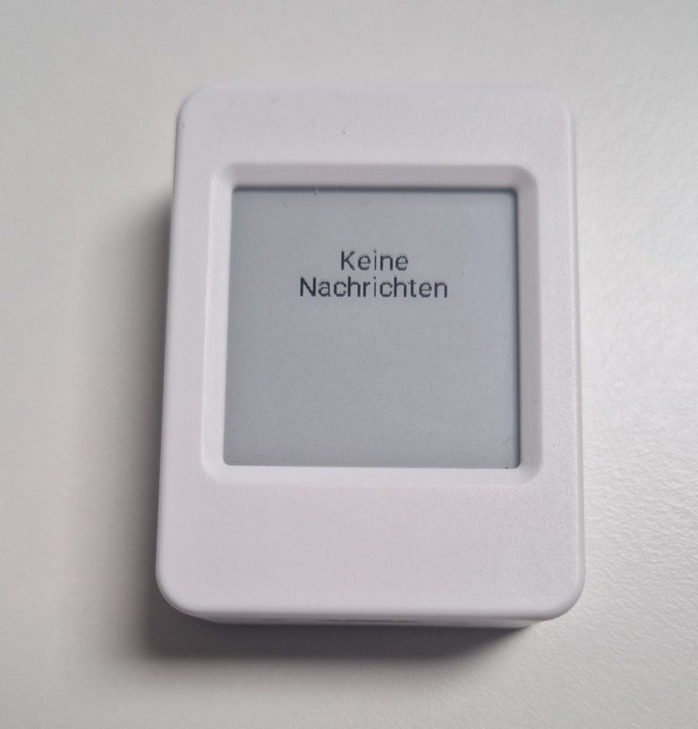
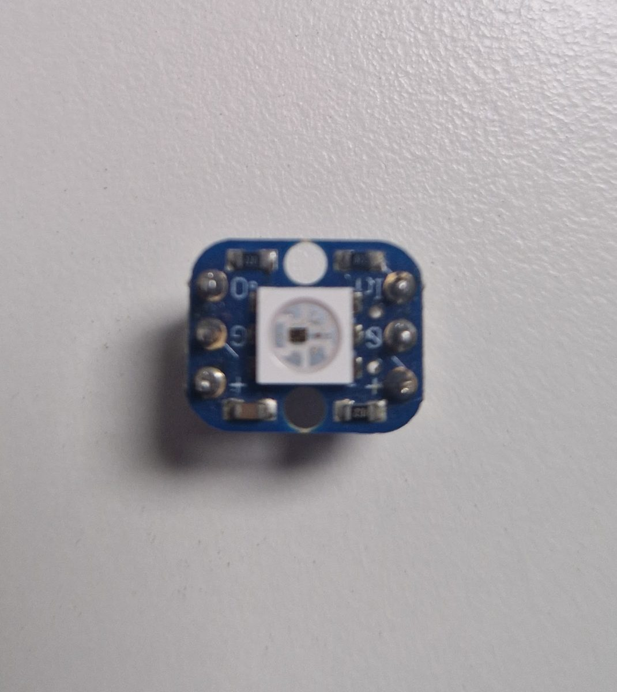

# NeoPixel wiring (Waveshare ESP32-S3 ePaper 1.54G)

On the back of the case is a [2×6 female header](https://docs.waveshare.com/ESP32-S3-ePaper-1.54G#pinout-definition).  
Three pins are wired to the LED:

| LED | Board   |
|-----|---------|
| GND | **GND** |
| VCC | **3V3** |
| DIN | **GP1** |

Firmware expects data on GPIO1.  
The header only has 3.3 V, so a single WS2812B is not very bright.  
But enough to catch attention.  

Three jumper wires (male one end, female the other), bundled in spiral wrap.  
Male into the board header, female onto the LED.

Firmware: `num_leds: 1` for a single WS2812B, `num_leds: 37` for M5Stack NeoHEX

Links:
- [Waveshare docs](https://docs.waveshare.com/ESP32-S3-ePaper-1.54G)
- [ESPBoards pinout](https://www.espboards.dev/esp32/waveshare-esp32-s3-epaper-1-54g/)
