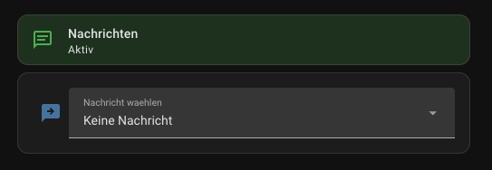

# Home Assistant

Helpers, automation, then the dashboard.  
Colour and sound are not on the dashboard, they come from the `style` table.

## Helpers

Copy `homeassistant/helpers/input_select.yaml` into your HA config, e.g.:

```yaml
# configuration.yaml
input_select: !include_dir_merge_named helpers/
```

Put the file at `config/helpers/input_select.yaml` (or merge it into an existing helpers file).

## Automation

Copy `homeassistant/automations/epaper_message_style.yaml` to `config/automations/` and include:

```yaml
automation: !include_dir_merge_list automations/
```

Or paste it via **Settings → Automations → Create → Edit in YAML**.

Edit only the `style` dict.
When you pick a message, colour and sound follow.

| Message             | Colour | Sound |
|---------------------|--------|-------|
| Dinner is ready     | yellow | on    |
| Call me             | red    | on    |
| Be right back       | green  | on    |
| Coming later        | blue   | on    |
| Please get in touch | red    | on    |

`colour`: `default` \| `red` \| `green` \| `blue` \| `yellow` \| `off`
`sound`: `default` \| `on` \| `off`

## Dashboard

Import `homeassistant/lovelace/dashboard-message.yaml` as a new dashboard, or add the cards to an existing view.

I used [Mushroom Cards](https://github.com/piitaya/lovelace-mushroom) from [HACS](https://hacs.xyz/).
Optional `card-mod` for the green/red status background.



## Device

After flashing `esphome/message.yaml`, entities show up under device **Message**, including:

- `binary_sensor.message_acknowledge` (PWR button)
- `binary_sensor.message_status`
- `light.message_monitor_notification_light`

If HA already knew the device under an older name, it keeps that entity ID.  
Change the dashboard YAML to match, or rename the entity in HA.
